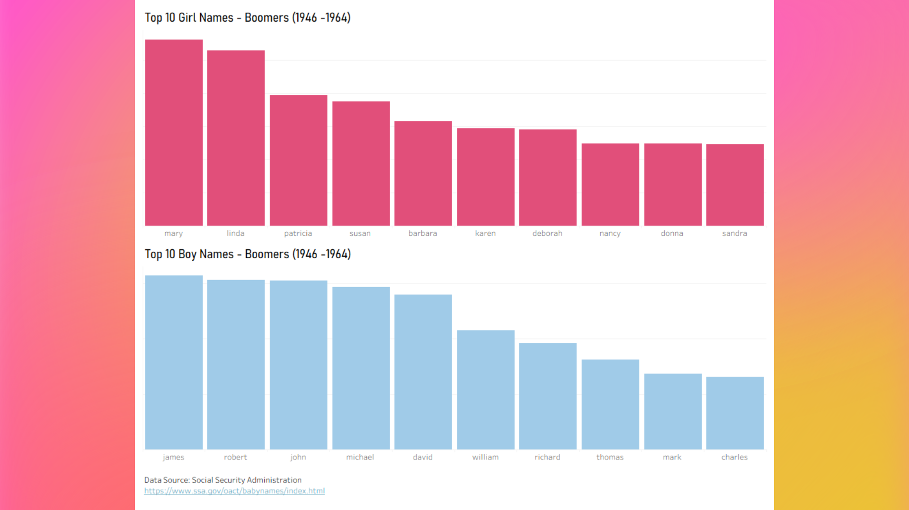
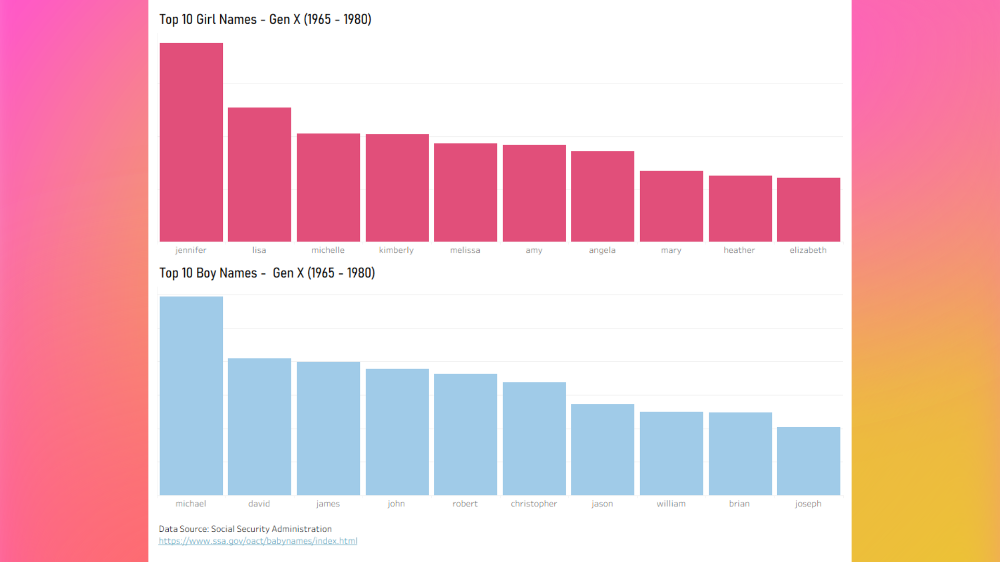
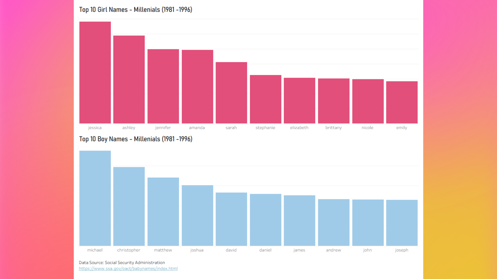
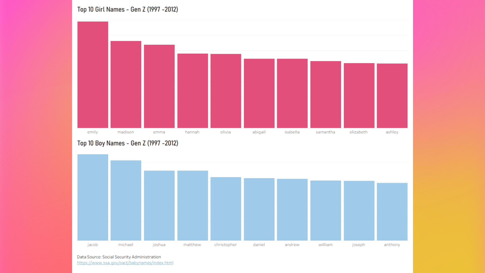

# How Basic Is Your Name?

A visual exploration of U.S. baby names by generation, designed for
Instagram-style data storytelling.

**Source:** U.S. Social Security Administration (1880–2024)

---

## Top 10 Baby Names by Generation

---

## Boomers (1946–1964)

---

## Gen X (1965–1980)

---

## Millennials (1981–1996)

---

## Gen Z (1997–2012)

---

## Gen Alpha (2013–2024)

---

## About the Project

- **Data:** SSA Baby Names (100% of SS card applications), .txt files converted into one pandas df and exported  as csv
- **Analysis:** Python (pandas)
- **Visualization:** Tableau + Canva
- **Goal:** Shareable data stories
